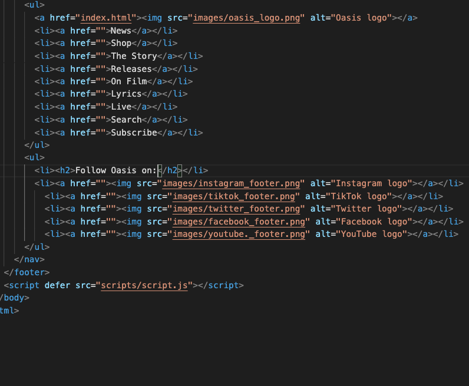

# Procesverslag
Markdown is een simpele manier om HTML te schrijven.  
Markdown cheat cheet: [Hulp bij het schrijven van Markdown](https://github.com/adam-p/markdown-here/wiki/Markdown-Cheatsheet).

Nb. De standaardstructuur en de spartaanse opmaak van de README.md zijn helemaal prima. Het gaat om de inhoud van je procesverslag. Besteedt de tijd voor pracht en praal aan je website.

Nb. Door *open* toe te voegen aan een *details* element kun je deze standaard open zetten. Fijn om dat steeds voor de relevante stuk(ken) te doen.

## Jij

  
uitwerken voor kick-off werkgroep

  ### Auteur:
  Nina van den Ham

  #### Je startniveau:
  Blauw

  #### Je focus:
  Responsive
 

## Je website

  
uitwerken voor kick-off werkgroep

  ### Je opdracht:
  https://oasisinet.com

  #### Screenshot(s) van de eerste pagina (small screen): 
  Home 
  

  #### Screenshot(s) van de tweede pagina (small screen):
  Releases
  
 

## Toegankelijkheidstest 1/2 (week 1)

  
uitwerken na test in 2e werkgroep

  ### Bevindingen
  Lijst met je bevindingen die in de test naar voren kwamen:
  •In de code wordt geen duidelijke toelichting gegeven over/bij verschillende links en forms.
  •Er zijn geen tekst alternatieve of alt descripties bij afbeeldingen.
  •Heading levels worden geskipt, er wordt wel netjes gestart met h1 en h2, maar daarna gaat het direct naar h4.
  •Videos bevatten geen ondertiteling.

## Breakdownschets (week 1)

  
uitwerken na afloop 3e werkgroep

  ### de hele pagina: 
  

  ### dynamisch deel (bijv menu): 
  

## Voortgang 1 (week 2)

  
uitwerken voor 1e voortgang

  ### Stand van zaken
  Bij het maken van de breakdownschets en dus ook bij de html vind ik het soms lastig te zeggen waar bepaalde sections beginnen en/of eindigen. Ook vind ik het lastig te stellen wanneer er gebruik gemaakt moet worden van paragrafen in plaats van headers.
  
  Moet/kan de titel van een menubalk in een lijnstructuur?
  

  ### Agenda voor meeting
  samen met je groepje opstellen

  | Nina           |  Sem               | Sam          | Bronger          |
  | ---            | ---                | ---          | ---              |
  | Onduidelijkheid over start en eind van sections. 
  Wanneer headings of paragrafen.  
  Opzet lijnstructuur. | en dit             | en ik dit    | en dan ik dat    |
  |  | dit als er tijd is | nog een punt | dit wil ik zeker |
  |  | ...                | ...          | ...              |

  ### Verslag van meeting
  - Correctie van de navigatie.
  - Aria-label (tekst wordt voorgelezen, maar zie je niet.)
  - Ally (website over toegankelijkheid)
  - ...

## Voortgang 2 (week 3)

  
uitwerken voor 2e voortgang

  ### Stand van zaken
  Ik vind het nog lastig om te beginnen met de css, maar het is me wel gelukt om de eerste basis van mijn hamburgermenu te maken.

  ### Agenda voor meeting
  samen met je groepje opstellen

  | student 1      | student 2          | student 3    | student 4        |
  | ---            | ---                | ---          | ---              |
  | dit bespreken  | en dit             | en ik dit    | en dan ik dat    |
  | en dat ook nog | dit als er tijd is | nog een punt | dit wil ik zeker |
  | ...            | ...                | ...          | ...              |

  ### Verslag van meeting
  hier na afloop snel de uitkomsten van de meeting vastleggen

  - Maak goed gebruik van comments.
  - punt 2
  - nog een punt
- ...

## Toegankelijkheidstest 2/2 (week 4)

  
uitwerken na test in 9e werkgroep

  ### Bevindingen
  Lijst met je bevindingen die in de test naar voren kwamen (geef ook aan wat er verbeterd is):
  Uit de toegankelijkheidstest van mijn website is gebleken dat de basislay-out goed is dankzij het gebruik van headings op de juiste plekken en in de correcte volgorde. Daarnaast is er op mijn site zorgvuldig omgegaan met alternatieve teksten (alts) voor afbeeldingen, wat een verbetering is ten opzichte van de officiële website waar dit ontbreekt. Een tekortkoming die ik helaas deel met de officiële site is het ontbreken van ondertiteling bij video’s, terwijl dit wel vereist is. Verder werkt de zoomfunctie op mijn website goed, maar veroorzaakt deze bij gebruik de verschuiving van enkele elementen, wat niet wenselijk is. Hoewel mijn website aan de toegankelijkheidseisen voldoet, zijn er enkele aspecten van de lay-out die hieronder lijden.

## Voortgang 3 (week 4)

  
uitwerken voor 3e voortgang

  ### Stand van zaken
  Het is gelukt om de eerste css te schrijven, merk wel dat ik het soms lastig vind om de correcte selectoren te vinden, zo duurde het bijvoorbeeld even voordat ik de carousel eindelijk goed aansprak. Na redelijk wat css code te hebben geschreven, merk ik weer hoe lastig ik het vind om er een beetje orde over te houden, hier komen ook de comments bij ter sprake, ik moet hier goed op letten, voordat het een enorme chaos wordt en ik zelf ook niet meer weet wat alles is.

  ### Agenda voor meeting
  samen met je groepje opstellen

  | Nina      | student 2          | student 3    | student 4        |
  | ---            | ---                | ---          | ---              |
  | De html code in de footer wordt aangesproken door de eerder geschreven css, hoe moet ik hiermee werken? | en dit             | en ik dit    | en dan ik dat    |
  |  | dit als er tijd is | nog een punt | dit wil ik zeker |
  | ...            | ...                | ...          | ...              |

  ### Verslag van meeting
  hier na afloop snel de uitkomsten van de meeting vastleggen

  - Om het juiste gedeelte van de code aan te spreken, moet je specifiek aangeven in de css om welke gedeelte van de code het gaat. (header, main, footer)
  - De search in de navigatie is een button, het brengt je niet naar een andere pagina en is dus geen link (a).
  - nog een punt
  - ...

## Eindgesprek (week 5)

  
uitwerken voor eindgesprek

  ### Je uitkomst - karakteristiek screenshots:
  

  

  

  

  ### Dit ging goed/Heb ik geleerd: 
  Ik ben erg trots op het hamburgermenu. Het heeft me laten zien dat, hoe moeilijk de oefening ook lijkt, het toch mogelijk is om het zelf toe te passen.

  
  

  Het maken van de carousel was lastig. Ik liep lange tijd tegen het probleem aan van de verkeerde selectoren, maar het is uiteindelijk gelukt en heeft me geholpen om er wat meer inzicht in te krijgen.

  

  Ik had moeite met het toevoegen van de zoekknop; deze verscheen niet in beeld. Na goed te kijken, ontdekte ik dat de knop samen met het hamburgermenu-icoontje van het scherm werd geduwd wanneer het scherm werd vergroot. Door een extra klasse toe te voegen aan de zoekknop, heb ik dit probleem kunnen oplossen.

  
  

  Het lukte maar niet om de knoppen te laten werken op een groter schermformaat, totdat ik ontdekte dat de flex-container van het hamburgermenu ervoor zat. Door de z-index van de knoppen aan te passen, werden ze weer klikbaar.

  

  ### Dit was lastig/Is niet gelukt:
   Het is gelukt om de website responsive te maken, maar het was een uitdaging en de overgangen naar verschillende schermgroottes verlopen op sommige punten nog niet helemaal soepel. Zo had ik bijvoorbeeld veel moeite met het responsive maken van het footermenu en het plaatsen van het menu in twee kolommen naast elkaar. Na veel inspanning is het gelukt, maar sommige details ontbreken nog of komen niet helemaal overeen met het origineel. 

  

  Op de releasepagina heb ik een muziekfilter- en selectiefunctie toegevoegd, maar het lukte lange tijd niet om deze goed werkend te krijgen; alle items bleven zichtbaar in plaats van te filteren. Na wat geknutsel met de code ontdekte ik dat het wel werkt wanneer ik de display-instelling van flex uitschakel. Dat was een stap vooruit, maar nu blijven de items in één rij onder elkaar staan, in plaats van netjes verdeeld in drie kolommen naast elkaar.
  
  
  

  

## Bronnenlijst

  
continu bijhouden terwijl je werkt

  Nb. Wees specifiek ('css-tricks' als bron is bijv. niet specifiek genoeg). 
  Nb. ChatGpT en andere AI horen er ook bij.
  Nb. Vermeld de bronnen ook in je code.

  1. Officiële website: https://oasisinet.com
  2. Codepen (Hamburgermenu, carousel, darkmode)
  3. ChatGPT (Darkmode, filter)

